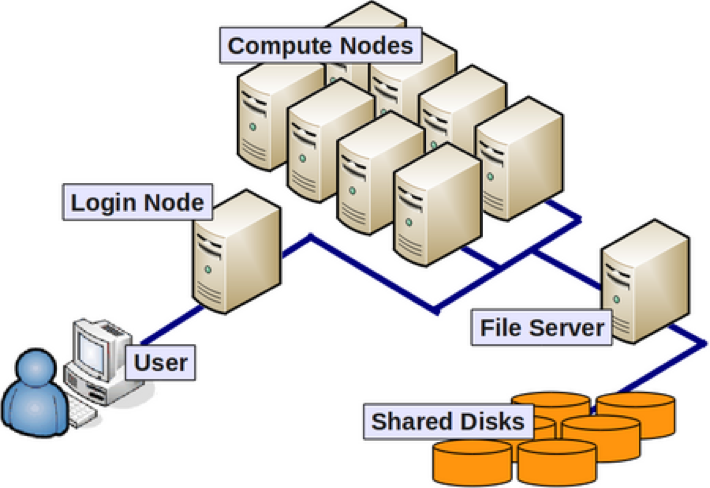

## Part 2: Using the Biology Server

* The Biology server is a high-performance computing (HPC) resource.
  
  * It is often referred to as a "cluster" because it is a collection of computers
    * Each computer is called as a “node”
    * Each node features multiple processors and RAM.
  * A central computer, known as the "head node," controls these nodes.
  * However, the Biology server consists of only a single computer.
* It utilizes the SLURM management system for job scheduling and management.


### Activity 3
| | | |
|-|-|-|
| Step 1 | Connect to Emory VPN     | |
| Step 2 | Copy files to remote server      | Filezila |
| Step 3 | Connect to remote server     | Git Bash (New Windows)<br>Termina (MacOS)
| Step 4 | Write a Bash Script to Submit a Job      | * ```nano``` - text editor |
| Step 5 | Check the server before submitting job(s)        | * ```sinfo``` - check the node status <br>* ```squeue``` - check the job status | 
| Step 6 | Submit a job to SLURM        | * ```sbatch``` |
| Step 7 | Check the job status/results & manage job        | * ```scontrol`` |  
| Step 8 | Download file to local directory     | Filezila |


### Step 1: Connect to Emory VPN
* open BIG-IP client 
 


* Enter your Emory NetID and Emory password
  
* Now you are connected to Emory VPN


### Step 2: Copy files to remote server


* Imagine we need to perform analysis on the Biology server, but our data is currently on our local laptop/desktop. In this situation, it's necessary to transfer our files to the remote server, in this case, the Biology server.
* Several options exist for copying/transferring files to a remote server, but we'll use a GUI-based program named FileZilla. If you haven't installed this program yet, download it [here](https://filezilla-project.org/download.php?type=client).
* Open FileZilla. At the top (marked in red), enter the remote server's information. On the left side (marked in yellow), you'll see your local directories. The right side will display the remote directories once connected to the remote server.  <br> 
* Enter the following details in the boxes at the top and click the Quickconnect button:
    > - Host: bio.emory.edu
    > - Username: use your Emory NetID, but for today, use ```ypar279```
    > - Password: _______
    > - Port: 22

<br>

* You may encounter a pop-up asking if you want to remember the password. If so, select "Do not save passwords."
* If a pop-up appears regarding an Unknown host key, click OK.

* Navigate to and enter the DVA_workshop folder on the remote server, then create a directory as usual (right-click > "Create directory and enter it"). Name the folder after your Emory NetID. <br> 


* Once your directory is set up, you can drag-and-drop the files you wish to transfer from the left side (local directories) to the right side (remote directories). 


### Step 3: Connect to remote server
* Open Terminal (Mac) or Git Bash (Windows) to log in to the server from your laptop.

* Use the command ```ssh EMORY_NETID@bio.emory.edu``` -p22. For today, we'll use my account, but once you have your own account, you'll use your Emory NetID to log in to the server. Once you see the question asking if you want to continue connecting, type ```yes```. 
<br> 
 

* Now, use the password provided during the workshop to finish logging in. Remember, this password differs from your Emory password.

* Once logged in, check the current directory using the pwd command and navigate to your directory in the DVA_Workshop folder using the cd DIRECTORY command. Again, you can use Tab key to list possible options. 


### Step 4: Write a Bash Script to Submit a Job
* Similar to Activity #2, we'll write a bash script for our analysis.
  
* However, this time we have additional steps because we need to submit jobs through the SLURM management system.

    ```
    #!/bin/bash 
    #SBATCH --job-name=first_job
    #SBATCH --partition=3day-long
    #SBATCH --output=slurm-%A.out
    #SBATCH --error=slurm-%A.err
    #SBATCH --ntasks=1
    #SBATCH --mem-per-cpu=10

    ## module load R/4.0.2		## not in biology server

    cd $HOME/DVA_workshop/ypar279

    ## run analysis for control group
    mkdir result_control
    Rscript script_analysis.r rawdata_control/data_1.csv 1

    ## run analyses for experimental groups
    for num in {0..9}; do               
      mkdir result_experimental_${num}
      Rscript script_analysis.r "rawdata_experimental_${num}/data_1.csv" 1
    done
    ```

    

* In the very first part of the script, we have lines starting with ```#SBATCH```. These lines specify the resources you wish to request from SLURM. We will come back to this in the next section. 
    
* In the second section, lines starting with ```module``` appear. This command is used to load necessary modules or programs in some clusters using SLURM, such as the RSPH cluster. However, on the Biology server, this command is not required.

* In the final section, we input bash commands as usual. Here, I've simply copied and pasted the script from Activity #2. Note that I added `cd $HOME/DVA_workshop` because sometimes jobs submitted to SLURM begin in different locations.

* Practice writing a text or bash file using the ```nano``` command. You can copy and paste the script provided above.


### Step 5: Check the server before submitting job(s)

#### Understanding the resource you need
* Going back to the cluster. 
    
  * cluster is a collection of computers (nodes)
  * each computer (node) can have several processors (CPU) and RAM. 
  * computers (nodes) could be grouped into a 'partition' with specific settings, e.g., time limit 

* Now let's look at the first part of the script again. 
    ```
    #!/bin/sh 
    #SBATCH --job-name=hostname
    #SBATCH --partition=3day-long
    #SBATCH --output=hostname.out.%J
    #SBATCH --error=hostname.err.%J
    #SBATCH --time=0-00:01
    #SBATCH --ntasks=1
    #SBATCH --mem-per-cpu=10
    ```
  * line 1 (`--job-name`): set the name of the job
  * line 2 (`--partition`): determines the partition to submit your job
  * line 3 and 4 (`--output` and `--error`): determines the file names to store the outputs or error messages as jobs submitted to SLURM won't print output or error messages on the screen
  * line 5 (`--time`): determines the Maximum walltime the job can run. After this time has expired, the job will be stopped.
  * line 6 (`--ntasks`): how many cores you expect your software to use.
  * line 7 (`--mem-per-cpu`): Memory that is allocated per core for the job. If you exceed this memory limit, your job will be stopped.
  * ntasks-per-node: Number of cores per node. For example, if –nodes=2 and –ntasks-per-node=2, then a total of 4 cores will be requested.
  * mem: Specify the real memory required per node in MegaBytes. If you exceed this limit, your job will be stopped. Note that for you should ask for less memory than each node actually has.
  * Some cluster support email alert once the job is done
    ```
    #SBATCH --mail-user=YOUR_EMORY_ID@emory.edu
    #SBATCH --mail-type=END
    ```

For more information, you can visit these webpages:
* https://scholarblogs.emory.edu/rsph-hpc/how-to-create-a-slurm-file/
* https://bioinformatics.ibers.aber.ac.uk/training/IBERS-HPC-tutorial/04-running-jobs/

#### Checking the server before submitting job(s)
 
* To determine the partition to submit a job, we would like to first check how busy the partitions are. 
  * `sinfo` shows the partition and node information. 
  * `squeue`: shows the job information on SLRUM scheduling queue.

  * Based on `sinfo` and `squeue` outputs, it seems like `3day-long` partition is busy. Let's use `5day-long` partition for our job. 

### Step 6: Submit a job to SLURM
* Finally, we are ready to submit our job. Use ```sbatch SCRIPT_FILENAME``` command to submit your job. Once it is submitted, you will get the job number. 


### Step 7: Check the job status/results & manage job
* We can check the status of our jobs using `squeue`. 
* We can also read the screen output stored in slurm-JOBID.out with `cat slurm-JOBID.out` command. If `cat slurm-JOBID.out` is too long, you can also use `tail slurm-JOBID.out`. 


* Submit the same job with ```sbatch SCRIPT_FILENAME``` and cancel the job using `scancel`

### Step 8: Download file to local directory
* Now, once analyses are done, we can download the results using FileZila agian. 

